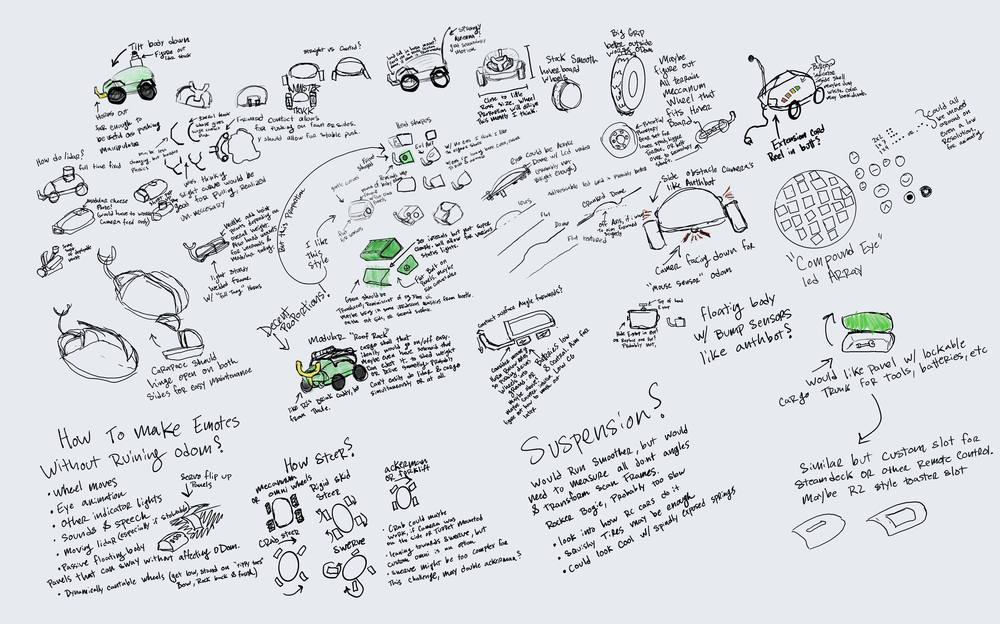

# BETL (BPU-Education, Transport, Lidar), pronounced "Beetle"

A scratch-built, bio-inspired expressive lidar mobile robot on the **RDK X5**, built for the
**Robotics Dream Keeper Challenge** (D-Robotics, 2026). It drives, builds 2D occupancy
maps, and runs BPU-accelerated object detection concurrently — a modular research platform
with personality baked in from the start.

> **Status:** Stage 2 (Build) complete — see [`PROPOSAL.md`](PROPOSAL.md) and
> [`ROADMAP.md`](ROADMAP.md). Stage 3 (working demo) in progress toward July 15.

---

## What it is

- **4-wheel skid-steer** base: hoverboard hub motors, 4× Flipsky ODESC V4.2 drivers on the
  X5's native **CAN FD** bus, AS5600 wheel odometry.
- **Concurrent perception:** YOLOv8s object detection on the **BPU** + `slam_toolbox` 2D
  occupancy mapping on the **CPU** — the two concurrent workloads, on separate compute units.
- **Forward sensing:** D-Robotics stereo (BPU detection + depth) and RealSense D435i
  (active-IR depth + IMU), fused so their failure modes cancel. Side 8×8 ToF for obstacle
  avoidance.
- **"Poor-man's spherical lidar":** a 2D RPLIDAR A1 on a closed-loop-stepper-driven slip-ring
  stage, encoder-reprojected into a 3D point cloud — an **optional, swappable payload**.
- **Modular by payload:** an M6-grid cheese plate; a software-declared capability system
  where optional modules (lidar, cargo load cell, future sensors) enhance behavior when
  present but never gate the always-present baseline.
- **Personality from the start:** round-array LED eyes, a scrolling status panel, and a
  deterministic offline Speak & Spell-style voice ("Hey Betl").
- **Learning on-robot (goals):** a mass-conditioned energy-efficient locomotion policy and
  a goal-conditioned ball-pushing policy, both trained in Isaac Lab with sim-to-real
  calibration from real motor telemetry.




## Architecture at a glance

See [`PROPOSAL.md`](PROPOSAL.md) for the full system-flow and ROS 2 node-graph diagrams,
module design with failure modes, compute allocation, and the engineering plan (BOM,
timeline, risks). Diagrams render inline on GitHub (Mermaid).

Key property: **one path to the motors.** Every velocity source — teleop, nav/policy,
obstacle veto, cargo-drop event — funnels through a single arbitration node carrying the
soft e-stop, backed by an independent hardware e-stop.

## Repository layout

```
PROPOSAL.md      Stage 2: concept, architecture, engineering plan (+ diagrams)
ROADMAP.md       Milestones and dates through the demo
docs/            benchmark methodology, architecture notes, build journal
ros2_ws/src/     ROS 2 packages (bringup, description, drive, perception, slam,
                 lidar_pkg, safety, capability, voice, expression)
firmware/        RP2350 micros (stage controller, odometry, power, load cell, LED)
isaac/           Isaac Lab policies (locomotion, ball-push)
models/          Vendored YOLOv8s .bin + inference pipeline
tools/           Roller-dyno characterization
cad/             Frame, Y-horn, cheese plate, wheel scans
```

## Follow the build

- **YouTube** (RustedFriend) — weekly recap build log + the Stage 3 demo
- **Instagram / Threads** (RustedFriend) — visual updates
- **Discord** — running build log

## License

TBD.
