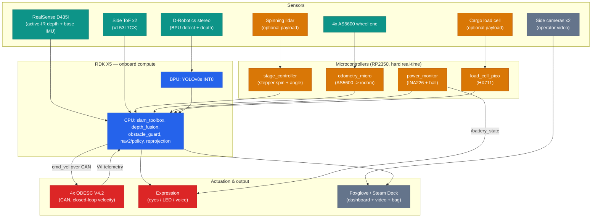
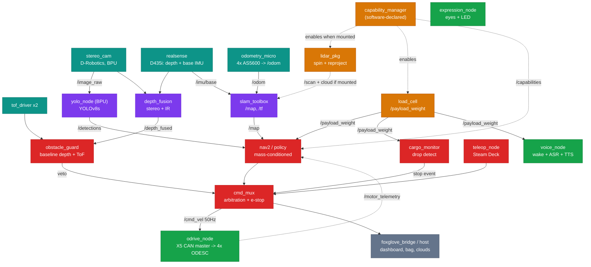

# Stage 2 Proposal — RustedFriend's RDK X5 Robot ("Beetle")

*Robotics Dream Keeper Challenge — Stage 2 (Build)*
*Version 1.0 — 2026-06-27*

A scratch-built, expressive lidar mobile robot on the RDK X5 — a modular research platform
for developing and testing robotics skills. It drives, builds 2D occupancy maps, runs
BPU-accelerated object detection concurrently, supports modular payloads via an M6-grid
cheese plate, and serves as the deployment target for learned locomotion and manipulation
policies.

This document aggregates the three Stage 2 challenges:
1. **Concept & Application Design** — what it is, who it's for, measurable goals.
2. **AI System Architecture** — flow diagram, node graph, module design, compute allocation.
3. **Engineering Plan** — BOM, timeline, risk analysis, repo structure.

---

# Challenge 1 — Concept & Application Design

A scratch-built, expressive lidar mobile robot on the RDK X5 — a modular research
platform for developing and testing robotics skills, upgraded over time. It drives,
builds 2D occupancy maps, runs BPU-accelerated object detection concurrently, supports
modular payloads via an M6-grid cheese plate, and serves as the deployment target for
learned locomotion and manipulation policies.

> *All targets below are initial design goals set pre-build; they will be validated and
> refined against measured performance through Stage 3.*

---

## Scenario

The robot operates in **three payload configurations**, each with its own operating envelope:

- **Scan config (spinning lidar mounted):** indoor, controlled, flat — building/floor-plan
  scans. Ambient indoor light, active sensors, no controlled-lighting dependency. Primary
  mapping mode; scan-quality targets apply here.
- **Transport config (lidar swapped for roof rack):** indoor and outdoor including uneven
  ground — navigation and obstacle avoidance on RealSense + side-ToF + cameras, no spinning
  lidar mounted. Obstacle-detection-to-response **< 150 ms**; reliable obstacle detection
  across side-ToF range **0.02–3.5 m**.
- **Bare config (no top payload):** teleop, autonomy, and ball-push policy demos — lightest,
  most agile.

*Open experiment (not a primary spec):* scanning with the lidar on uneven/outdoor ground,
relying on IMU + odometry slip-detection to reject corrupted scan frames — a robustness test
of the sensor-fusion pipeline, not a claimed operating mode.

---

## User

The primary user is the builder/operator (RustedFriend); the robot is a personal research
and capability-building platform. Primary interaction is **mixed human-robot command**:
manual Steam Deck teleop as the always-available baseline, layered with wake-word voice
command-and-response ("Hey Beetle, …") and laser-pointer target designation. The Steam Deck
docks in the robot to stay charged and powered, making the voice path a primary demo interface
rather than only a teleop backup.

**Success criteria:**
- Operator issues a laser-designated goal and the robot acts on it without keyboard input.
- Teleop retains control authority at all times via hardware e-stop.
- Voice grammar recognizes a fixed command set with **≥ 90% intent-recognition** in a quiet room.

---

## Core AI Capabilities

- **Perception:** BPU-accelerated YOLOv8s detection (COCO 80-class), **≥ 30 FPS sustained
  concurrently with SLAM**, INT8, 640×640.
- **Mapping/localization:** 2D occupancy-grid SLAM on CPU, concurrent with detection —
  satisfies the two-workload requirement.
- **Sensor fusion:** spinning-lidar reprojection cross-checked against fixed side-ToF and
  wheel-encoder/IMU odometry; commanded-vs-measured-motion disagreement (wheel encoders vs.
  IMU) flags and discards bad scan frames.
- **Decision/actuation:** soft-guidance-to-hard-refusal obstacle avoidance, operator override
  capped to gentle push speed; ODESC closed-loop velocity control with safety limits.
- **Voice command & response:** wake-word activation ("Hey Beetle") feeding offline ASR over a
  fixed command grammar, a strict dialogue state machine, and a synthesized/clip-based retro
  voice for responses. Deterministic and fully offline — no LLM in the loop for this iteration;
  motor-invoking commands execute only on confident grammar matches, with unrecognized input
  returning a "didn't catch that" response. Supports fixed queries (battery level, facing
  distance), a templated scene readout ("1 person, 10 feet away; 1 chair, 4 feet away" assembled
  from YOLO classes + RealSense depth), and parameterized commands via slot-filling (e.g. "scan
  a 15-foot rectangle"). A small local LLM as a paraphrase/fallback intent layer is a documented
  future upgrade, gated behind the same deterministic command executor.
- **Learned policies (deployed on-robot):**
  1. Energy-efficient locomotion under variable load, Isaac Lab-trained against a
     roller-dyno-calibrated motor model.
  2. Goal-conditioned ball-pushing via Y-contact horn, laser-designated target.
  3. High speed tokyo drift policy. (may wait for suspension and steering upgrade)

---

## Innovation / Differentiation

- Concurrent BPU detection + CPU SLAM on a **scratch-built welded chassis**, not a kit.
- **Poor-man's 3D lidar:** single 2D spinning lidar on a slip-ring stage, encoder-reprojected
  to pseudo-3D, with fixed side-ToF as a transform-consistency cross-check.
- **Sim-to-real with measured calibration:** policies trained against a motor model calibrated
  from real ODESC telemetry on a roller dyno, validated on-floor.
- **Mechanically-aided manipulation:** the Y-horn's two-point contact passively centers the
  ball, simplifying the learned pushing policy — design-for-learnability.
- **Modular payload platform** on a standardized M6 mounting grid — a reconfigurable research
  base reusable across the three configs and future upgrades.
- **Expressive from the start:** LED-matrix eyes, a multipurpose scrolling LED display (status,
  text, animations), and synthesized voice — state made legible to humans, and a testbed for
  the emotive/interactive behaviors that interest me.

---

# Challenge 2 — AI System Architecture

> Architecture targets and allocations below are pre-build design intent; utilization
> figures are estimates to be replaced with measured values during Stage 3. Several
> low-level integration choices (scan reprojection method, exact micro-ROS transport)
> are marked provisional and reference the tthom289 spinning-lidar repos as prior art.

---

## 1. System Overview

The robot is organized around two principles that the rest of the architecture follows from:

**Timing-tiered compute.** Work is placed on the hardware whose timing guarantees match
the job. Hard-real-time sensing and the motor control loop live on dedicated
microcontrollers and on the ODESC drivers themselves; best-effort perception and planning live on the
RDK X5. The X5 is never asked to guarantee a deadline that a microcontroller should own.

**Baseline + capability tiers.** A fixed baseline sensor set is assumed always present, and
all safety-critical and core functions depend only on it. Optional payload modules
(starting with the spinning-lidar package) are **declared in software** (via voice/Foxglove/
config), discovered by a capability manager, and used opportunistically — they enhance behavior
when present but never gate it. Future modules (sound level, environmental, etc.) attach the
same way.

**Baseline tier (always present, on the base):**
D-Robotics stereo camera (BPU detection + stereo depth), Intel RealSense D435i (active-IR
depth + built-in IMU serving as the base IMU), 2× side 8×8 ToF (VL53L7CX), 4× wheel encoders
(AS5600, 4-wheel skid steer).

**Capability tier (optional, software-declared):**
Spinning-lidar package (RPLIDAR A1 on an encoded slip-ring stage + onboard reprojection;
stage IMU added with future mast); cargo load cell (HX711) on the cargo payload; future
sensor modules.

The two forward depth cameras are run together permanently and fused, so their failure modes
cancel: passive stereo loses depth on textureless surfaces where active-IR fills it in;
active-IR washes out in bright sunlight where stereo holds up.

---

### Architecture Diagrams

**System flow** — sensors through three compute domains (microcontrollers, X5 CPU+BPU, host) to actuators, separating machine-consumed perception from human-consumed context:



**ROS 2 node graph** — nodes by compute domain, baseline vs. optional tiers, topics and approximate rates. Every velocity source funnels through `cmd_mux` (single path to motors, carries e-stop):



> Diagram notes: `imu_monitor` + stage IMU are **future (with the mast)** — single D435i IMU this iteration. Side cameras bypass the perception graph (operator video only). Payload declaration is **software** this iteration (NFC scrapped for scope).

---

## 2. Module Design — Responsibilities, I/O, Failure Modes

| Module | Inputs | Outputs | Primary failure mode → handling |
| --- | --- | --- | --- |
| `stereo_cam` | image pair | `/image_raw`, `/stereo/depth` | Textureless-surface depth holes → covered by RealSense via `depth_fusion` |
| `realsense` | — | `/rs/depth`, `/rs/color` | IR washout in sunlight → covered by stereo via `depth_fusion` |
| `depth_fusion` | both depth streams | `/depth_fused` | One camera drops out → pass through the surviving source; flag degraded |
| `tof_driver ×2` | I²C frames | `/tof/left`, `/tof/right` | Sensor dropout → obstacle_guard falls back to camera depth in that sector |
| `yolo_node` (BPU) | `/image_raw` | `/detections` | BPU contention under load → throttle FPS, SLAM unaffected (separate unit) |
| `scene_describer` | `/detections`, `/depth_fused` | spoken scene readout | Missing depth for a box → report class without range |
| `odometry_micro` | 4× wheel enc (AS5600) | `/odom` | Encoder slip (skid-steer scrub) → flagged via encoder-vs-IMU disagreement; SLAM corrects |
| `stage_controller` | stage encoder (stepper) | `/stage_angle`, spin drive | Spin-rate instability → flagged vs. commanded; pause scan |
| `imu_monitor` *(future, with mast)* | `/imu/base`, `/imu/stage` | `/imu_health` | Single IMU this iteration (D435i) → cross-check activates when stage IMU added with mast |
| `capability_manager` | software declaration (voice/Foxglove/config) | `/capabilities`, node lifecycle | Mis-declaration → operator re-declares; baseline unaffected |
| `load_cell` | HX711 strain reading | `/payload_weight` | Drift/temp → manual tare (tare-on-empty command) |
| `cargo_monitor` | `/payload_weight`, motion state | drop-detected event | Vibration false-trigger → debounce (sustained step) + gated to cargo-mode-while-moving |
| `slam_toolbox` | `/scan`, `/odom`, `/imu/base` (D435i) | `/map`, `/tf` | Scan stream loss → localization-only against saved map |
| `obstacle_guard` | `/depth_fused`, `/tof/*` (+ lidar if present) | velocity veto | — (this *is* the safety floor; baseline-only by design) |
| `nav2 / policy` | `/map`, goal, `/payload_weight`, (lidar cloud if present) | `/cmd_vel_raw` | Planner failure → teleop remains authoritative; load cell absent → default-load assumption |
| `teleop_node` | Steam Deck input | `/cmd_vel_raw` | Always-available manual baseline; never removed |
| `cmd_mux` | all cmd_vel sources, e-stop | `/cmd_vel` | Single arbitration point; hardware e-stop overrides all |
| `odrive_node` (X5 CAN master) | `/cmd_vel` | motor drive (4× ODESC), `/motor_telemetry` | Closed-loop velocity runs on each ODESC; X5 command loss → safe stop |
| `voice_node` | mic, wake word | command intents, TTS | No-match → "didn't catch that"; motor cmds need confident match |
| `expression_node` | robot state | eyes / LED matrix | Non-critical; fails silent |

---

## 3. Compute Allocation

| Compute unit | Workloads | Est. utilization | Real-time class |
| --- | --- | --- | --- |
| **X5 BPU** (Bayes-e, ~10 TOPS) | YOLOv8s INT8 detection | 30–60% (≥30 FPS target, large headroom vs. ~220 FPS isolated) | Soft real-time |
| **X5 CPU** (8× A55 @ 1.8GHz) | slam_toolbox, depth_fusion, obstacle_guard, nav2/policy, scan reprojection, ROS 2 graph | 50–80% under concurrent load | Soft real-time |
| **Stage controller** (Teensy/RP2040, SimpleFOC) | lidar spin + stage-angle publish | dedicated | Hard real-time |
| **Odometry micro** (micro-ROS) | 4× wheel encoders (AS5600), timestamped | dedicated | Hard real-time |
| **ODESC** (×4, CAN bus) | closed-loop velocity, current/voltage telemetry | dedicated | Hard real-time (on-board) |
| **Host** (Steam Deck / PC, Wi-Fi) | point-cloud accumulation, dashboard, bag recording, offline policy/scan processing | best-effort | Non-real-time |

The two concurrent workloads required by the rubric — **BPU YOLOv8s detection** and **CPU
slam_toolbox** — run on physically separate compute units (BPU vs. CPU cores), so they
contend mainly for memory bandwidth rather than compute. Benchmark methodology reports both
isolated and concurrent numbers; concurrent FPS will be lower than the ~220 isolated figure
and that is expected and correct.

---

## 4. Module → Thread / Core / Real-Time Constraint

| Module | Process / thread | Core affinity | Rate | Real-time constraint |
| --- | --- | --- | --- | --- |
| `stage_controller` | MCU firmware | dedicated MCU | 200 Hz stage angle | Hard — jitter corrupts reprojection |
| `odometry_micro` | MCU firmware | dedicated MCU | 100 Hz | Hard — feeds slip-detection timing |
| ODESC velocity loop (×4) | ODESC firmware | dedicated | kHz internal | Hard — on-board, not X5-dependent |
| `cmd_mux` + e-stop | ROS 2 node | pinned core | 50 Hz | Soft-hard — safety arbitration path |
| `obstacle_guard` | ROS 2 node | shared CPU | 30 Hz | Soft — <150 ms detect-to-veto target |
| `cargo_monitor` | ROS 2 node | shared CPU | ~50 Hz (gated) | Soft — debounced drop event, cargo-mode-while-moving only |
| `yolo_node` | BPU + host thread | BPU + 1 core | ≥30 FPS | Soft — perception cadence |
| `depth_fusion` | ROS 2 node | shared CPU | 30 Hz | Soft |
| `slam_toolbox` | ROS 2 node | shared CPU (multi-thread) | 10 Hz scan / 1 Hz map | Soft — best-effort mapping |
| `imu_monitor` *(future, w/ mast)* | ROS 2 node | shared CPU | 100 Hz | Soft — activates with stage IMU |
| `voice_node` | ROS 2 node | shared CPU | event-driven | Non-RT — wake-word gated |
| `expression_node` | ROS 2 node | shared CPU | ~30 Hz | Non-RT — cosmetic |
| host offload | off-board | Steam Deck / PC | best-effort | Non-RT |

---

## 5. Key Architectural Properties (for review)

- **Single path to the motors.** Every velocity source funnels through `cmd_mux`, which
  carries the soft e-stop; an independent hardware e-stop cuts motor power below the software
  entirely. Obstacle avoidance is a velocity veto into this mux, not a separate actuator path.
- **Graceful degradation by design.** The baseline tier is a hard contract; optional modules
  are pure enhancement. No configuration silently loses a safety function when a payload is
  swapped off.
- **Slip-detection (single IMU this iteration).** Wheel-encoder odometry is cross-checked
  against the D435i IMU; disagreement beyond the kinematically explainable bound flags slip
  (significant on skid steer) and corrupted scan frames. A second stage IMU is added with the
  future deployable mast, enabling base-vs-stage oscillation cross-check and generalizing to a
  5-IMU array when suspension is added (one per arm + center).
- **Self-documenting recordings.** A single timestamped bag captures all synced sensor and
  telemetry topics plus the active `/capabilities` state, serving both offline scan analysis
  and learned-policy datasets.
- **Sensor-fusion redundancy.** Dual forward depth cameras (passive stereo + active IR) cover
  each other's failure surfaces; the lidar, when mounted, adds a 360°/long-range layer that
  enhances planning without being a dependency.
- **Multi-role cargo load cell.** One sensor serves three tiers: passive query ("how much does
  this weigh"), continuous mass-conditioning of the locomotion policy, and an active drop-detect
  safety monitor (`cargo_monitor`). Tared manually (tare-on-empty command) since payload
  declaration is in software this iteration.

---

## Provisional / open items

- Scan reprojection node placement (X5 CPU vs. lidar subsystem) — leaning X5-side for unified
  fusion; reference tthom289 repos for the spin/reproject pattern.
- Exact micro-ROS transport (serial vs. USB) between micros and X5.
- Drive type: 4-wheel skid steer for this iteration (mechanical simplicity / timeline);
  Ackermann steering noted as a future-arc upgrade (no scrub, better odometry/efficiency).
- Whether the closed-loop stepper driver exposes live angle for reprojection, else AS5600 on shaft.

---

# Challenge 3 — Engineering Plan

> Build strategy: electronics integration is **decoupled from the welded frame**. All
> drivetrain, compute, and perception bring-up happens on a temporary "breadboard chassis"
> (electronics bolted to scrap board) starting immediately, in parallel with waiting on
> weld stock. When frame parts arrive (~July 3), known-good subsystems are **transplanted**
> onto the welded frame rather than debugged there for the first time. This removes the
> frame-parts delivery date from the software critical path.

---

## 1. Bill of Materials

> `[SUPPLY]` marks line items needing a SKU/link, specific model, or quantity from the builder.
> Quantities and notes reflect current design intent; provisional parts flagged.

### Compute & control
| Part | Qty | SKU / link | Notes |
| --- | --- | --- | --- |
| RDK X5 dev board | 1 | `[SUPPLY]` | In hand; BPU/YOLO path confirmed |
| Flipsky ODESC V4.2 (single-drive BLDC) | 4 | Amazon B0CB64MVHC | ODrive 3.x-firmware compatible; single-motor per board → 4 for skid steer. **Daisy-chained on X5's native CAN FD bus** (run classic CAN @1Mbps); unique node ID each; terminate last ODESC only |
| Stage controller MCU (RP2350 / Pico 2-class) | 1 | Amazon B0DP5YK6M4 (or official Pico 2) | SimpleFOC lidar spin + stage IMU; USB/UART to X5; confirm pinout |
| Odometry MCU (RP2350 / Pico 2-class, micro-ROS) | 1 | Amazon B0DP5YK6M4 (or official Pico 2) | Wheel enc (from ODESCs) consolidation + base IMU + NFC; USB/UART to X5 |
| Load-cell MCU (RP2350 / Pico 2-class) | 1 | Amazon B0DP5YK6M4 | Cargo-payload module brain; reads HX711 |
| Power-monitor MCU (RP2350 / Pico 2-class) | 1 | Amazon B0DP5YK6M4 | Dedicated power module; reads hall current + bus/rail voltage → micro-ROS |
| LED-display MCU (RP2350 / Pico 2-class) | 3 | Amazon B0DP5YK6M4 | One per display: 2 eyes + 1 status panel; per-display for wiring/troubleshooting isolation |
| Spare RP2350 boards | 2 | Amazon B0DP5YK6M4 | Future capability modules; standard module brain |

### Drivetrain
| Part | Qty | SKU / link | Notes |
| --- | --- | --- | --- |
| Hoverboard hub motor | 4 | `[SUPPLY]` | 4-wheel skid steer |
| AS5600 magnetic encoder (wheel) | 4 | `[SUPPLY]` | 12-bit absolute (4096/rev, ~0.09°) on each wheel shaft → **odometry Pico** (I²C addr fixed 0x36 → use PWM mode or TCA9548A mux for 4). ODESCs run commutation off hoverboard halls. Odometry good on straights; skid-steer scrub degrades turns (SLAM/IMU correct) |
| Wheels (3D-scanned to CAD) | 4 | — | From hoverboard motors |

### Sensors — baseline tier
| Part | Qty | SKU / link | Notes |
| --- | --- | --- | --- |
| D-Robotics stereo camera module | 1 | `[SUPPLY]` | BPU detection + stereo depth; in hand |
| Intel RealSense D435i (confirm) | 1 | `[SUPPLY]` | Active-IR depth; in hand. **If D435i, its built-in IMU can serve as base IMU** → may need only 1 separate IMU |
| DFRobot SEN0628 8×8 ToF (VL53L7CX) | 2 | SEN0628 | Side obstacle + Foxglove viz |
| Side context camera | 2 | salvage (mower) | Operator video to Foxglove only; **confirm USB UVC** ingest, not proprietary analog |
| IMU | 0 (use D435i's) | — | **D435i built-in IMU serves as the single base IMU this iteration.** Lidar is rigidly frame-mounted, so no independent stage IMU needed yet. Add a stage IMU (BNO08x-class, ~$30-50) when the deployable mast happens — that's when the two-IMU cross-check earns its place |
| (NFC payload tags) | — | **scrapped** | Payload declared in software (voice/Foxglove/config) instead; capability-manager unchanged. Load cell tared manually |

### Sensors — capability tier (optional payloads)
| Part | Qty | SKU / link | Notes |
| --- | --- | --- | --- |
| RPLIDAR A1 | 1 | in hand | Spinning slip-ring 3D-scan rig |
| Slip ring (USB) | 1 | reuse (old lidar robot) | Carries USB power+data to spinning lidar; proven on prior build. **Test spinning under load** — slip-ring USB can drop out with contact wear, which corrupts scans |
| Closed-loop NEMA 17 stepper (+ driver) | 1 | `[SUPPLY]` | Lidar spin; encoder does step correction AND should expose live angle for reprojection. **CRITICAL: verify driver outputs encoder position (UART/SPI/CAN) — many keep it internal.** If not exposed → add AS5600 on shaft. Driver must do continuous velocity |
| Load cell + HX711 amplifier | 1 | HX711 (Amazon) + `[SUPPLY]` cell | Cargo payload; cargo Pico reads it (load-cell only). Manual tare |

### Power
| Part | Qty | SKU / link | Notes |
| --- | --- | --- | --- |
| EGO 56V 5.0Ah battery (14S, ~59V max) | 2 | `[SUPPLY]` | Run one at a time; hot-swap the other |
| Logic-rail buck converter (≥72V in → 5V/≥5A) | 1 | e.g. Amazon B0D3V5FZPT (10-72V→5V/5A) or REES52 11-90V synchronous | **≥72V input for headroom over 58.8V bus**; prefer synchronous-rectification for lower ripple; add output cap; X5 brownout-sensitive — NOT a 60V-max module |
| USB power bank ("dumb", no auto-shutoff) | 1 | `[SUPPLY]` | Swap-time logic backup; diode-ORed onto 5V rail (not a manual switch) |
| Ideal-diode OR (5V) / Schottky pair | 1 | `[SUPPLY]` | Seamless handoff buck↔USB pack; no timing dependence |
| 5V rail hold-up capacitor | 1 | `[SUPPLY]` | Glitch insurance during swap |
| INA226 + hall current sensor (ROS path) | 1 | `[SUPPLY]` | Bus V (to 59V via divider/range) + current; read by power-monitor Pico → `/battery_state` `/power_draw`; coulomb-count for SoC |
| (Alt) 0-90V/100A hall coulomb-counter meter | — | e.g. DROK charge-discharge meter | Standalone LCD gauge w/ Ah/Wh; plug-and-play SoC but no ROS data out — use only if Pico path is deferred |
| Power-monitor read via dedicated Pico → micro-ROS | — | — | Publishes `/battery_state`, `/power_draw`; feeds voice readout + low-batt warning + bag logging |
| Onboard backup battery (hot-swap) | 1 | `[SUPPLY]` | Covered by USB-pack approach above (logic rail) |
| ODrive brake resistor | 4 | `[SUPPLY]` | Regen dissipation; **critical** — keeps bus under 60V ODESC limit on regen; size per setup |
| TVS / bus clamp (motor rail) | `[SUPPLY]` | `[SUPPLY]` | Optional spike insurance near ODESC 60V ceiling |

### Frame & mechanical
| Part | Qty | SKU / link | Notes |
| --- | --- | --- | --- |
| Aluminum frame stock (weld) | `[SUPPLY]` | `[SUPPLY]` | Awaiting delivery (~July 3) |
| M6 cheese plate (top payload interface) | 1 | `[SUPPLY]` | Grid + cable pass-throughs |
| Green acrylic shell panels | `[SUPPLY]` | `[SUPPLY]` | Bolt-on, diffused |
| Beetle horn (Y-contact, CAD) | 1 | — | Ball-push manipulation |

### Expression
| Part | Qty | SKU / link | Notes |
| --- | --- | --- | --- |
| Round addressable LED array (eyes) | 2 | `[SUPPLY]` | WS2812-family; mood/pupil animations; one Pico each; note px count `[SUPPLY]` |
| WS2812B strip 100 LED/m (status panel) | 15 m (3×5m reels) | `[SUPPLY]` | Serpentined into one 80×16 panel (800×160 mm), 1280 px; ~220 px buffer |
| Speaker + audio out | 1 | parts bin | Speak & Spell voice; confirm X5 audio-out path |
| Microphone | 1 | parts bin | Wake word + ASR; **USB or I²S MEMS easiest** (analog electret needs ADC/amp) |

### Test equipment (not on robot)
| Part | Qty | SKU / link | Notes |
| --- | --- | --- | --- |
| Roller dyno rig | 1 | self-built | Motor characterization; ODrive V/I logging |

---

## 2. Timeline (through July 15)

| Window | Focus | Frame-dependent? |
| --- | --- | --- |
| **Jun 27 – Jul 2** | **Breadboard chassis.** Electronics on scrap board. ODrive closed-loop motors driving. X5 ↔ micros ↔ ODrive comms. YOLO+SLAM concurrent on bench. Roller-dyno motor characterization. Rough both demo segments on the test rig. | No |
| **Jul 3 – Jul 8** | Weld parts arrive → **weld frame** → **transplant** known-good electronics. Mount lidar + slip-ring stage. Reprojection + mapping-while-driving solid on real chassis. Continuous footage capture begins. | Yes |
| **Jul 9 – Jul 13** | Reliability passes on both demo segments. Tune obstacle avoidance + e-stop behavior. Benchmark runs (isolated + concurrent, p95 latency). | Yes |
| **Jul 14 – Jul 15** | Shoot + **edit 3–7 min demo video**. Finalize benchmark table, README, `docs/`. Submit PR to `projects/`, post community share, attach permalink. | — |

**Parked (post-deadline / if-time-permits, not on critical path):** voice command system,
load cell + cargo monitor, NFC capability system, trained policies (locomotion, ball-push),
charging, side-camera Foxglove integration, weathering/finishing. All present in the
architecture; none required for the two demo segments.

---

## 3. Risk Analysis (top 5)

| # | Risk | Trigger / early signal | Mitigation |
| --- | --- | --- | --- |
| 1 | **Frame weld parts delayed past July 3** | No delivery by July 3 | Already mitigated: breadboard-chassis decoupling means software progresses regardless; weld becomes an end-stage transplant, not a blocker. Slip absorbs into the Jul 3–8 window. |
| 2 | **Drivetrain bring-up harder than expected** (ODrive tuning, hoverboard motor quirks) | Motors not driving smoothly by ~Jul 1 on the test rig | Bench-first on breadboard chassis with full week of buffer; fall back to lower-speed/simpler velocity tuning; teleop baseline needs only basic velocity control. |
| 3 | **YOLO+SLAM concurrent contention** degrades below target under real load | Concurrent FPS or SLAM rate drops sharply vs. isolated | BPU/CPU are separate units (low compute contention); decimate clouds; lower SLAM update rate; report honest concurrent numbers (expected lower). |
| 4 | **Spinning-lidar reprojection / TF instability** | Maps smear or fail to close; IMU cross-check flags oscillation | Drive-smooth + hold-still-during-scan discipline; two-IMU verification; reference tthom289 reprojection approach; fall back to lower spin rate. |
| 5 | **Video + writeup time underestimated** | Past Jul 13 with no edited footage | Capture footage continuously from Jul 3; reserve Jul 14–15 exclusively for edit/writeup; demo segments designed to be independently shootable. |

### Mechanical notes
- **Wheel encoder mounting (AS5600).** Hub motors have no free shaft end, so each AS5600 mounts on a fender-style bracket wrapping the wheel, sensor outboard on the **wheel's rotation centerline** (not over the rim — off-axis reads fail), with a diametric magnet glued dead-center on the wheel's outer face at ~0.5–3mm gap. Bracket must be rigid **relative to the fixed axle** so wheel deflection on the no-suspension base doesn't wander the gap. Verify field strength via the AS5600 AGC register at setup. Model the bracket in CAD to keep URDF geometry accurate.
- **AS5600 I²C address is fixed (0x36)** — 4 wheels can't share one I²C bus. Read in PWM mode (one GPIO each, Pico PIO decodes 4 in parallel) or via a TCA9548A mux.

---

## 4. Repository Structure

```
/
├── README.md                  # Project overview, build status, links
├── PROPOSAL.md                # Stage 2: Challenges 1–3 aggregated
├── ROADMAP.md                 # Milestones + dates through demo
├── docs/
│   ├── images/                # Architecture diagrams (PNG/SVG/Mermaid)
│   ├── benchmark.md           # Methodology + isolated/concurrent tables, p95
│   ├── architecture.md        # Expanded module/architecture notes
│   └── build-journal/         # Session log, footage notes
├── ros2_ws/
│   └── src/
│       ├── beetle_bringup/    # Launch files, params, config
│       ├── beetle_description/# URDF (CAD-derived), payload variants
│       ├── beetle_drive/      # ODrive interface, cmd_mux, e-stop
│       ├── beetle_perception/ # yolo_node, depth_fusion, scene_describer
│       ├── beetle_slam/       # slam_toolbox config, scan reprojection
│       ├── beetle_lidar_pkg/  # spin stage, reprojection (optional module)
│       ├── beetle_safety/     # obstacle_guard, cargo_monitor
│       ├── beetle_capability/ # capability_manager, NFC, payload registry
│       ├── beetle_voice/      # wake, ASR, dialogue, TTS
│       └── beetle_expression/ # eyes, LED, voice clips
├── firmware/
│   ├── stage_controller/      # SimpleFOC spin MCU
│   └── odometry_micro/        # micro-ROS enc + IMU + NFC
├── isaac/
│   ├── locomotion_policy/     # energy-efficient, mass-conditioned
│   └── ball_push_policy/      # goal-conditioned Y-horn pushing
├── models/                    # Vendored YOLOv8s .bin + example pipeline
├── tools/
│   └── roller_dyno/           # Motor characterization scripts
└── cad/                       # Frame, horn, cheese plate, wheel scans
```

---

## Provisional / open items

- BOM `[SUPPLY]` fields: SKUs, specific models, quantities, battery chemistry/voltage.
- Whether wheel odometry derives from the ODrive or independent magnetic encoders.
- Exact micro-ROS transport (serial vs. USB).
- Whether the closed-loop stepper driver exposes live angle for reprojection (else AS5600 on shaft).
